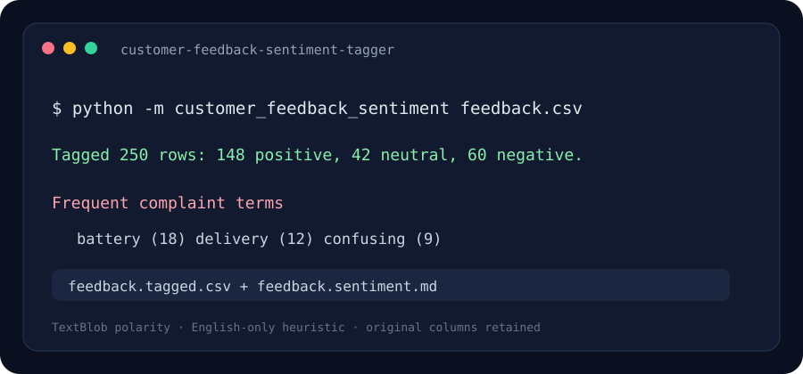

# Customer Feedback Sentiment Tagger

A small CSV workflow that labels English-language feedback as positive, neutral, or negative and summarizes common terms in negative reviews.

> The image above is an illustrative analysis preview.

## Problem it solves

Reading every short review manually can be slow when feedback grows. This project adds a polarity label and score to each row, then produces a concise summary that helps a person decide what to inspect next.

## Quick start

Requires Python 3.10 or later.

~~~powershell
python -m venv .venv
.venv\Scripts\Activate.ps1
python -m pip install -r requirements.txt
python -m customer_feedback_sentiment examples/feedback.csv
~~~

The command creates a tagged CSV and a Markdown report beside the input. For a different text column, use --text-column review_text.

## How it works

1. Reads a CSV while preserving the original columns.
2. TextBlob returns a polarity score from -1.0 to 1.0.
3. Scores above 0.1 are positive, below -0.1 are negative, and the middle band is neutral.
4. A small stopword filter counts frequent words in negative feedback.
5. The tool saves a tagged CSV and a Markdown executive summary.

## Project layout

- **customer_feedback_sentiment/analyzer.py** — CSV handling, polarity labels, term ranking, and report.
- **customer_feedback_sentiment/cli.py** — command-line options and output files.
- **examples/feedback.csv** — small sample dataset.
- **assets/preview.svg** — illustrative analysis preview.

## Tech stack

Python · TextBlob · csv · collections.Counter

## Limitations

TextBlob polarity is a lightweight English-language heuristic. It can misread sarcasm, negation, domain terms, and mixed-language comments. This project does not analyze Persian text. Treat results as a triage aid and review original feedback before acting on it.

## License

MIT.
